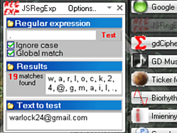

jsregexp
========

Plugin dla programu Google Desktop zapewniający możliwość testowania wyrażeń regularnych języka JavaScript.

Screeny
-------

Technologie
-----------
* Google Desktop Designer
* JavaScript
* XML

Uwagi
-----
- Plugin powstał w roku 2006 dla Google Desktop ver. 4.2006.505.0 i raczej nie będzie już uaktualniany.
